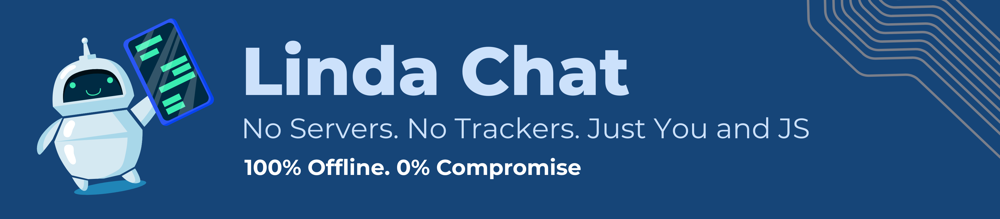
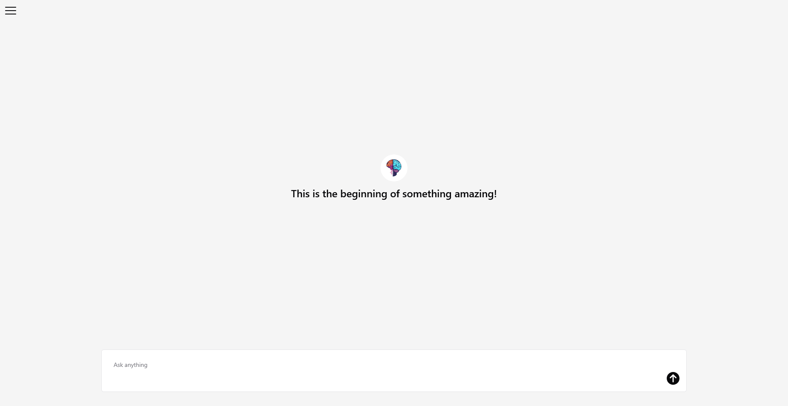
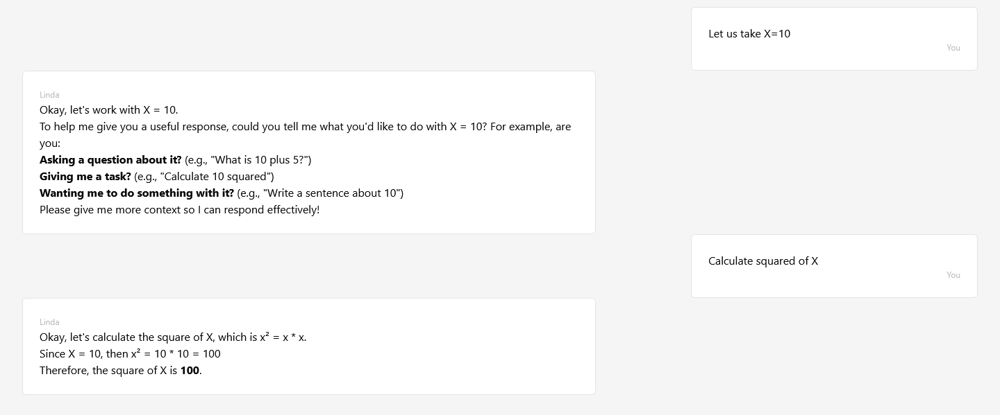
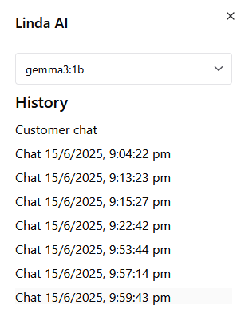

A custom built, browser only chat interface for ollama!

## Introduction
Linda Chat is a complete JS chat interface which has been fully integrated with Ollama. You don't need any additional setup apart from ollama model available offline with Node JS. Linda chat uses local storage in your browser to save chat information so you don't even need database.

## Features

#### Context Aware Models
Linda offers inbuilt support for saving your context. You can ask followup questions.

#### Unlimited models & chats

### Privacy friendly
Everything stays within your browser's local storage.

Made with ❤️ by Visweswaran N

